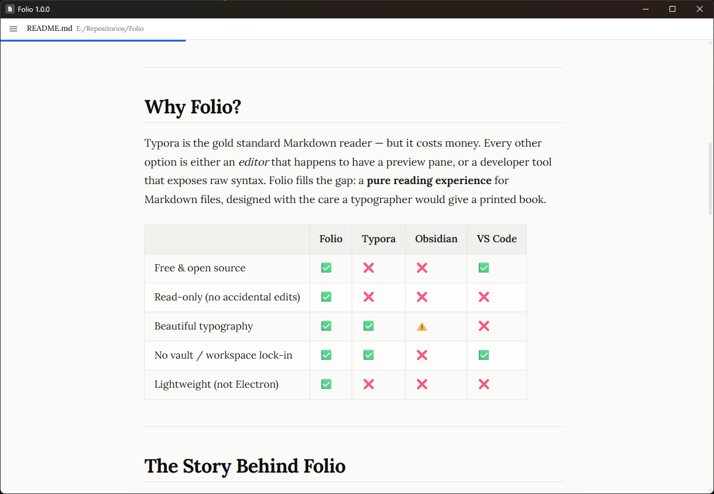

# Folio

**A free, open source, read-only Markdown viewer for desktop.**

> *"Open a `.md` file. Read it beautifully. Nothing else."*



---

## Download

| Platform | Installer |
|----------|-----------|
| **macOS** (Apple Silicon + Intel) | `.dmg` universal binary |
| **Windows** | `.msi` installer |
| **Linux** | `.AppImage` / `.deb` |

→ **[Download v1.0.0 from GitHub Releases](https://github.com/yourname/folio/releases/tag/v1.0.0)**

> **Note (v1.0.0 — unsigned release):**
> - **macOS:** Right-click the app → *Open* → confirm to bypass Gatekeeper on first launch.
> - **Windows:** Click *More info → Run anyway* in the SmartScreen prompt.
>
> Code signing is planned for v1.1.

---

## Why Folio?

Typora is the gold standard Markdown reader — but it costs money. Every other option is either an *editor* that happens to have a preview pane, or a developer tool that exposes raw syntax. Folio fills the gap: a **pure reading experience** for Markdown files, designed with the care a typographer would give a printed book.

| | Folio | Typora | Obsidian | VS Code |
|---|:---:|:---:|:---:|:---:|
| Free & open source | ✅ | ❌ | ❌ | ✅ |
| Read-only (no accidental edits) | ✅ | ❌ | ❌ | ❌ |
| Beautiful typography | ✅ | ✅ | ⚠️ | ❌ |
| No vault / workspace lock-in | ✅ | ✅ | ❌ | ✅ |
| Lightweight (not Electron) | ✅ | ❌ | ❌ | ❌ |

---

## The Story Behind Folio

I built Folio because I couldn't find a simple, beautiful Markdown reader that just worked. Every option I tried had at least one deal-breaker: paid and closed-source, ugly or unpolished, locked into a workspace or vault model, or primarily an *editor* with reading as an afterthought.

So I built the one I wanted.

**An experiment in LLM-driven development.** I'm a developer with experience in C#, Python, and Lua — but not in Rust, Tauri, or modern React. Rather than spending months learning a new stack from scratch, I used Folio as a deliberate experiment: could I build a real, polished desktop app almost entirely through conversation with LLMs? The answer turned out to be yes.

The project was built using [Claude](https://claude.ai) for architecture decisions and complex reasoning, and a local [Qwen](https://qwen.readthedocs.io/) model (via [llama.cpp](https://github.com/ggerganov/llama.cpp)) for faster iteration on smaller tasks. Every component, store, parser pipeline, and Rust command was written through this process.

**Why I'm sharing this.** I think transparency matters. This is a genuine experiment in a new programming style — using LLMs not as autocomplete, but as the primary implementation tool while the developer focuses on product vision, review, and direction. The result is a working app I'm proud of.

**What's next.** Now that v1.0.0 is out, I'm studying the codebase carefully — reading every file, understanding every decision — to fully own it and maintain it long-term.

---

## Features

- 📖 **CommonMark + GFM** — tables, task lists, strikethrough, footnotes, autolinks
- 🎨 **Light, dark, and sepia themes** with smooth animated transitions
- 🔦 **Syntax highlighting** for 20+ languages via Shiki (dual-theme aware)
- ∑ **Math rendering** with KaTeX (`$inline$` and `$$block$$`)
- 📊 **Mermaid diagram** rendering
- 📑 **Table of contents sidebar** with active heading tracking
- 🔍 **In-document search** with match count and keyboard navigation (`⌘F` / `Ctrl+F`)
- 📏 **Reading progress bar** (subtle, at the top of the window)
- ⌨️ **Jump-to-heading command palette** (`⌘G` / `Ctrl+G`)
- 👁️ **Focus mode** — gradient vignette to narrow attention to the current paragraph
- 🔄 **File watching** — auto-reloads when the source file is saved externally
- 🕐 **Recent files** — persisted across restarts (up to 20 entries)
- 🖨️ **Print / Export to PDF** with a clean print stylesheet
- ♿ **Accessibility** — full keyboard navigation, WCAG 2.1 AA, screen reader support
- 🔤 **Font selection** — Lora, Source Serif 4, Inter, OpenDyslexic, JetBrains Mono
- 🔎 **Zoom controls** — 70%–160% in 8 steps, persisted globally

---

## Building from Source

**Prerequisites:** [Node.js 20+](https://nodejs.org/), [pnpm](https://pnpm.io/), [Rust (stable)](https://rustup.rs/), and the [Tauri prerequisites](https://tauri.app/start/prerequisites/) for your platform.

```bash
# 1. Clone the repository
git clone https://github.com/yourname/folio.git
cd folio

# 2. Install JavaScript dependencies
pnpm install

# 3. Start the development build (hot-reload)
pnpm tauri dev

# 4. Build a production installer
pnpm tauri build
```

Installers are written to `src-tauri/target/release/bundle/`.

---

## Contributing

Contributions are welcome! Please read [CONTRIBUTING.md](CONTRIBUTING.md) before opening a pull request.

---

## License

Folio is released under the [GNU General Public License v3.0](LICENSE).
