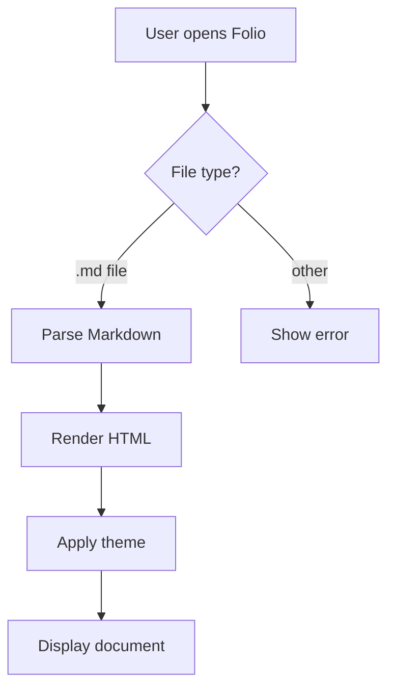
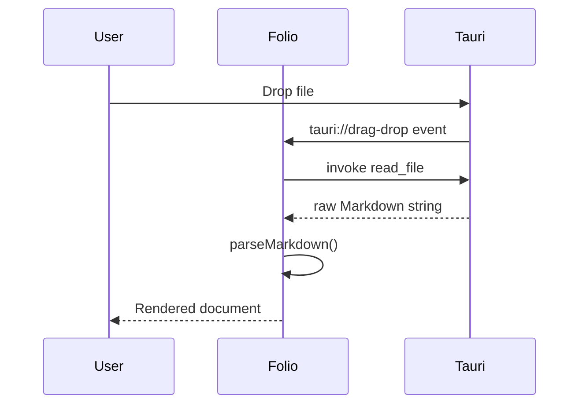

# M1 Beautiful Reader — Comprehensive Fixture

This document exercises every feature introduced in Milestone 1. Open it in Folio
and verify each section renders correctly in all three themes.

---

## 1. Typography and Headings

### H3 — A Third-Level Section

#### H4 — Fourth Level

##### H5 — Fifth Level

###### H6 — Sixth Level (muted)

Body text at 18px with 1.75 line height. The measure is capped at 68 characters per line
for optimal reading comfort. **Bold text** and *italic text* appear naturally within
flowing prose. Combined ***bold italic*** works too.

---

## 2. Links and Paragraphs

Visit [the Folio project](https://github.com/example/folio) for more information.
Here is a raw autolink: https://example.com — it should become clickable automatically.

Short paragraph. And a second paragraph immediately following to verify that margins
between paragraphs are consistent and breathable.

---

## 3. Blockquotes

> Typography is the art and technique of arranging type to make written language
> legible, readable, and appealing.
>
> — Robert Bringhurst, *The Elements of Typographic Style*

Nested blockquotes are also valid Markdown:

> Outer quote.
>
> > Inner quote — this is a nested blockquote.

---

## 4. Lists

### Unordered

- First item
- Second item with a longer description that might wrap across lines on smaller viewports
- Third item
  - Nested item A
  - Nested item B
    - Deeply nested item

### Ordered

1. Step one: install dependencies
2. Step two: configure Vite
3. Step three: build the app
   1. Sub-step: run TypeScript compiler
   2. Sub-step: bundle with Vite

### Task list

- [x] Install Shiki for syntax highlighting
- [x] Add KaTeX for math rendering
- [ ] Implement Mermaid diagrams
- [ ] Write documentation
- [ ] Ship v1.0

---

## 5. Tables

| Feature | Status | Notes |
|---------|--------|-------|
| Syntax highlighting | ✅ Done | Shiki dual-theme |
| Math rendering | ✅ Done | KaTeX, throwOnError=false |
| Mermaid diagrams | ✅ Done | Post-render useEffect |
| Local image resolution | ✅ Done | Tauri asset protocol |
| Theme switching | ✅ Done | CSS custom properties |
| Reading zoom | ✅ Done | --font-size-base on root |

---

## 6. Strikethrough

~~This feature was removed in v2.~~ It was later reinstated after user feedback.

~~Entire sentence struck out.~~

---

## 7. Inline Code and Code Blocks

Use `pnpm add shiki` to install the syntax highlighter. The function `parseMarkdown(raw, path)` returns a `ParseResult` object.

### JavaScript

```javascript
function greet(name) {
  const message = `Hello, ${name}!`;
  console.log(message);
  return message;
}
```

### TypeScript

```typescript
interface ParseResult {
  html: string;
  frontMatter: Record<string, unknown>;
  headings: Heading[];
}

async function parseMarkdown(
  raw: string,
  documentPath: string = "",
): Promise<ParseResult> {
  const { content, data } = matter(raw);
  const processor = await buildProcessor(documentPath);
  return { html: String(await processor.process(content)), frontMatter: data, headings: [] };
}
```

### Python

```python
def fibonacci(n: int) -> list[int]:
    """Return the first n Fibonacci numbers."""
    if n <= 0:
        return []
    seq = [0, 1]
    while len(seq) < n:
        seq.append(seq[-1] + seq[-2])
    return seq[:n]
```

### Bash

```bash
#!/usr/bin/env bash
set -euo pipefail

pnpm install
pnpm run build
echo "Build complete ✓"
```

### Rust

```rust
fn main() {
    let numbers: Vec<i32> = (1..=10).collect();
    let sum: i32 = numbers.iter().sum();
    println!("Sum of 1..10 = {}", sum);
}
```

### Unknown language (should render as plain monospace, no error)

```foobarbaz
This language is not registered.
It should render as plain monospace text without errors.
No syntax highlighting, no crash.
```

---

## 8. Math — KaTeX

### Inline math

Einstein's mass-energy equivalence: $E = mc^2$

The quadratic formula: $x = \frac{-b \pm \sqrt{b^2 - 4ac}}{2a}$

Euler's identity: $e^{i\pi} + 1 = 0$

### Block math

The Gaussian integral:

$$
\int_{-\infty}^{\infty} e^{-x^2} \, dx = \sqrt{\pi}
$$

Maxwell's equations in integral form:

$$
\oint_{\partial \Sigma} \mathbf{E} \cdot d\boldsymbol{\ell} = -\frac{d}{dt} \iint_{\Sigma} \mathbf{B} \cdot d\mathbf{S}
$$

### Invalid KaTeX (should show red error, not crash)

This contains a malformed expression: $\invalidcommand{broken}$ — it should show an inline error message in red rather than crashing the app.

---

## 9. Mermaid Diagrams

### Valid flowchart (should render as SVG)



### Valid sequence diagram



### Malformed Mermaid (should show error message, not blank space)

```mermaid
this is not valid mermaid syntax !!!
graph -->>>> broken syntax {{{
```

---

## 10. Footnotes

This is a claim that needs a citation.[^source1]

Here is another statement with an inline approach.[^source2]

Footnotes appear at the bottom of the document with back-reference links.

[^source1]: The source for this claim is Example et al. (2024). *Journal of Markdown Research*, 12(3), 45–67.
[^source2]: See also: Bringhurst, R. (2004). *The Elements of Typographic Style*. Hartley & Marks.

---

## 11. Images

### Remote image (should load from URL)


### Broken image reference (should not crash)


---

## 12. Horizontal Rules

Above this line is a paragraph.

---

Below the rule is a new section. Rules should be subtle — one pixel, muted colour.

---

## 13. HTML Entities and Special Characters

Typographic characters: em dash — en dash – ellipsis … left quote " right quote "

Mathematical symbols (plain text): ∑ ∫ ∂ ∞ ≈ ≠ ≤ ≥

Arrows: → ← ↑ ↓ ⇒ ⇐

---

*End of M1 fixture document.*
